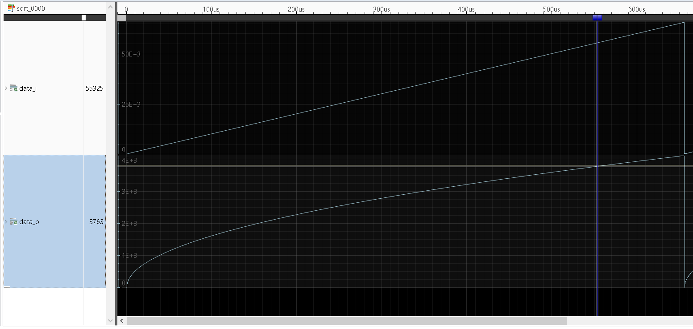

SQRT_V - Verilog implementation of a pipelined square-root
==========================================================

Features
--------

- Uses the same algorithm that I wrote in 68000 assembly language in the 90' : [sqrt.asm](./doc/sqrt.asm)
- Each stage takes (DATA_W + 2 * STAGE + 3) flip-flops (actually less thanks to constants propagation)
- Implemented in 2 hours of my spare time, it might not be bug-free but first results match the expected sqrt() curve

Files in this Repository
------------------------

#### README.md

You are reading it right now.

#### rtl/sqrt_12s.v

Example of a 12-stage implementation of a pipelined square-root.\
Input : 16 bits (integer) / 8 bits (fractional)\
Output : 8 bits (integer) / 4 bits (fractional)

#### rtl/sqrt_stage.v

One computation stage of the square-root.

#### verilator/clock_gen/

Configurable clock generator for Verilator.

#### verilator/compile.sh

Compile script for the Verilator testbench.

#### verilator/main.cpp

Main loop of the Verilator testbench.

#### verilator/tb_top.v

Verilator testbench configuration file.

Simulation screenshot
---------------------
